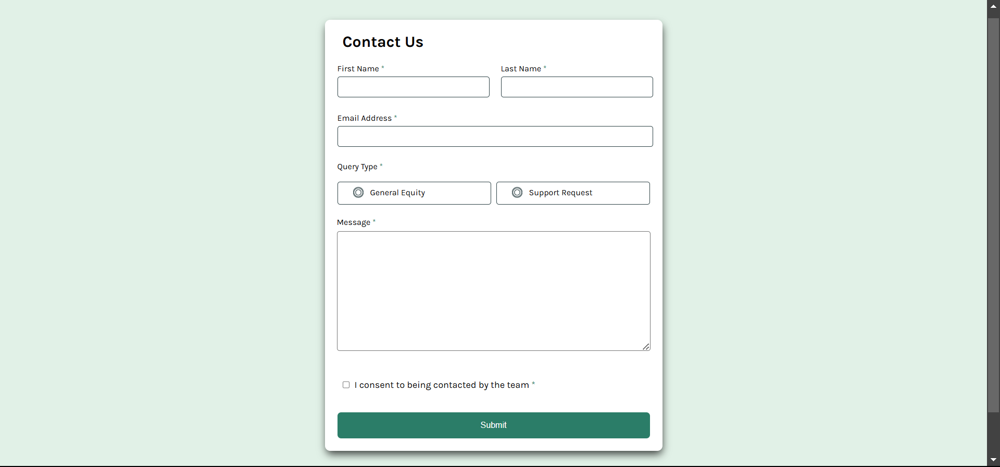

# Frontend Mentor - Contact form solution

This is a solution to the [Contact form challenge on Frontend Mentor](https://www.frontendmentor.io/challenges/contact-form--G-hYlqKJj). Frontend Mentor challenges help you improve your coding skills by building realistic projects. 

## Table of contents

- [Overview](#overview)
  - [The challenge](#the-challenge)
  - [Screenshot](#screenshot)
  - [Links](#links)
- [My process](#my-process)
  - [Built with](#built-with)
  - [What I learned](#what-i-learned)
  - [Continued development](#continued-development)
- [Author](#author)

## Overview

### The challenge

Users should be able to:

- Complete the form and see a success toast message upon successful submission
- Receive form validation messages if:
  - A required field has been missed
  - The email address is not formatted correctly
- Complete the form only using their keyboard
- Have inputs, error messages, and the success message announced on their screen reader
- View the optimal layout for the interface depending on their device's screen size
- See hover and focus states for all interactive elements on the page

### Screenshot



### Links

- [Solution URL](https://www.frontendmentor.io/solutions/responsive-contact-form-sywF1P9HoF)
- [Live Site URL](https://contactformfrontend.netlify.app/)

## My process

I followed the mobile-first workflow for this project, I structured the html file like this: 
```html
<main>
  <div class="form-container">
    <form>
      <h1>Contact Us</h1>
      <div class="text-input"></div>
      <div class="query-inputs"></div>
      <div class="message-input"></div>
      <div class="consent"></div>
      <button></button>
    </form>
  </div>
</main>
```
After failing at validating inputs beyond the first and last names, I decided to start the JavaScript code from scratch following a different approach, in which I made use of a helper function `showError` that takes in the input and the message to display in different states of that input. Thus, I targeted every input individually and wrote their validation functions.

```js
const showError = (input, message) => {
  const hint = input.parentElement.querySelector(".input-hint");
  hint.textContent = message;
  hint.style.display = message ? "block" : "none";

  if (message) {
    input.classList.add("error-state");
  } else {
    input.classList.remove("error-state");
  }
};
```
### Built with

- Semantic HTML5 markup
- CSS custom properties
- JavaScript
- Flexbox
- Mobile-first workflow

### What I learned

I faced some difficulties when trying to substitute the default radio with the custom svg buttons, so after looking up some online resources and with the help of chatGPT, I finally figured it out:
```html
<div id="radio-buttons" class="radio-buttons">

  <div class="radio-button" id="radio-button">
      <input type="radio" id="radio-btn1" name="radio-btn1">
      <label for="radio-btn1">
        <svg xmlns="http://www.w3.org/2000/svg" width="20" 
          height="21" fill="none" viewBox="0 0 20 21"><path fill="#0C7D69" 
          d="M10 .75a9.75 9.75 0 1 0 9.75 9.75A9.76 
          9.76 0 0 0 10 .75Zm0 18a8.25 8.25 0 1 1 
          8.25-8.25A8.26 8.26 0 0 1 10 18.75Zm5.25-8.25a5.25 
          5.25 0 1 1-10.499 0 5.25 5.25 0 0 1 10.499 0Z"/><svg>
            General Equity
      </label>
  </div>

  <div class="radio-button" id="radio-button">
      <input type="radio" id="radio-btn2" name="radio-btn1">
      <label for="radio-btn2">
          <svg xmlns="http://www.w3.org/2000/svg" width="20" 
            height="21" fill="none" viewBox="0 0 20 21"><path fill="#0C7D69" 
            d="M10 .75a9.75 9.75 0 1 0 9.75 9.75A9.76 
            9.76 0 0 0 10 .75Zm0 18a8.25 8.25 0 1 1 
            8.25-8.25A8.26 8.26 0 0 1 10 18.75Zm5.25-8.25a5.25 
            5.25 0 1 1-10.499 0 5.25 5.25 0 0 1 10.499 0Z"/><svg>
              Support Request
        </label>
  </div>
</div>     
```
CSS:
```css
.radio-button input[type="radio"] {
  display: none;
}

.radio-button label svg {
  display: inline-block !important;
  margin-right: .1rem;
}

.radio-button label svg path {
  fill: transparent;
  stroke: var(--Grey-900);
  stroke-width: 1;
}

.radio-buttons input[type="radio"]:checked + label svg path {
  fill: var(--Green-600);
  stroke: var(--Green-600);
}

.radio-button:hover {
  border-color: var(--Green-600);
  cursor: pointer;
}

.radio-button:hover label svg path {
  stroke: var(--Green-600);
}
```

I also learned about the `pointer-events` property in CSS when working with the success message, which controls how mouse interactions (like clicks, hovers, etc.) work for an element. When set to `none`:
  - The element ignores all mouse actions.
  - It's like the element is "invisible" to the mouse.

While I was working on the script, I learned that I can target an element that immediately follows another element using this syntax:
```js
document.querySelector("#fname + .input-hint").style.display = "block";
```
Where `#fname` is the first element, and the element with the class `.input-hint` is positioned immediately after it, and is the one we are targeting.

### Continued development

Compared to my earlier projects, I now feel relatively comfortable working with JavaScript. However, I’m still discovering new and better ways to handle common tasks, such as form validation. The key takeaway from building projects is that I’ve picked up many useful techniques along the way. My next goal is to complete a similar project in under 2 days, aiming to improve efficiency in productivity, time management, and delivery.

## Author

- Frontend Mentor - [@ziad-rima](https://www.frontendmentor.io/profile/ziad-rima)
- X - [@rima4082](https://www.twitter.com/yourusername)
- GitHub - [@ziad-rima](https://github.com/ziad-rima)


